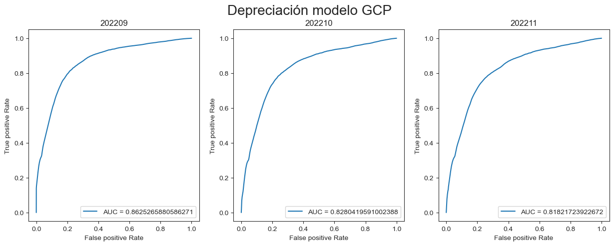
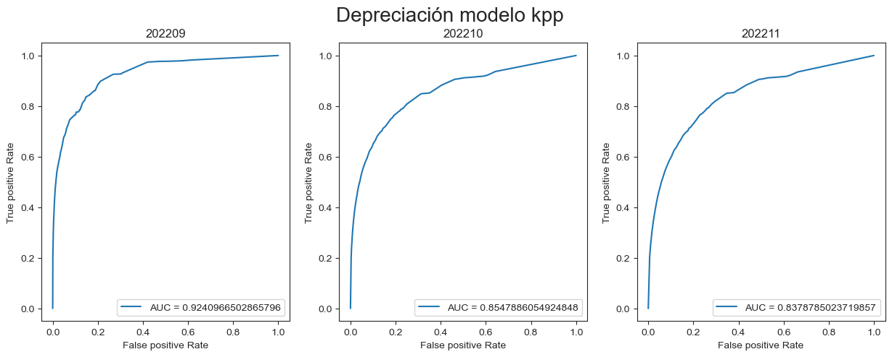
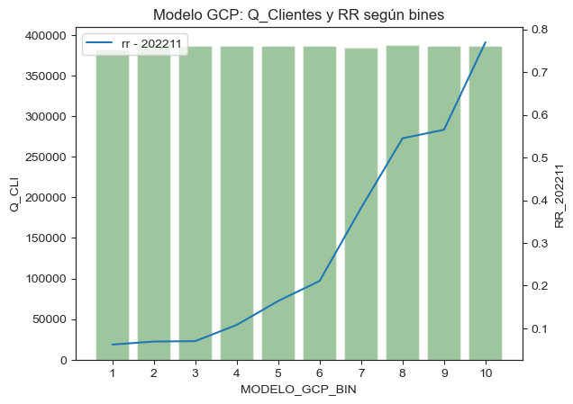
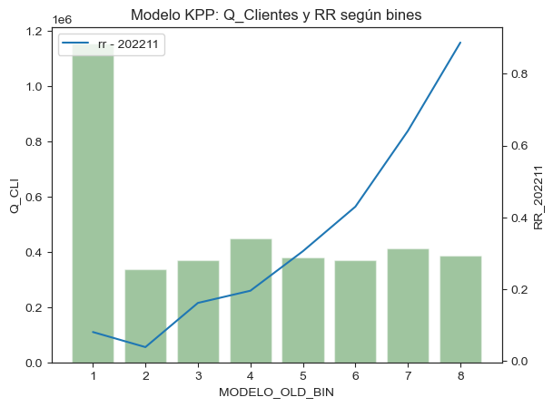

## Comparativa de performance de Modelo Apertura de MAIL: KPP vs GCP

#### Modelo old (kpp) entrenado en 202101 vs nuevo modelo (gcp) entrenado en 202206. Ambos con scoring para el 202209. Se compara el rendimiento en los meses posteriores.

```python
import pandas as pd
import matplotlib.pyplot as plt
from sklearn import metrics
import seaborn as sns
```


```python
tablon = pd.read_csv('TABLON2.csv',sep=',')
```


```python
kpp = pd.read_csv('KPP2.csv',sep=';')
```


```python
gcp = pd.read_csv('GCP2.csv',sep=';')
```

## Modelo GCP  -  score 202209


```python
fpr_gcp09, tpr_gcp09, thresholds_gcp09 = metrics.roc_curve(list(tablon['CONV_202209']),list(tablon['SC_MODELO_NEW']))
fpr_gcp10, tpr_gcp10, thresholds_gcp10 = metrics.roc_curve(list(tablon['CONV_202210']),list(tablon['SC_MODELO_NEW']))
fpr_gcp11, tpr_gcp11, thresholds_gcp11 = metrics.roc_curve(list(tablon['CONV_202211']),list(tablon['SC_MODELO_NEW']))
```


```python
auc_gcp09 = metrics.roc_auc_score(list(tablon['CONV_202209']),list(tablon['SC_MODELO_NEW']))
auc_gcp10 = metrics.roc_auc_score(list(tablon['CONV_202210']),list(tablon['SC_MODELO_NEW']))
auc_gcp11 = metrics.roc_auc_score(list(tablon['CONV_202211']),list(tablon['SC_MODELO_NEW']))
```


```python
fig, (ax1, ax2, ax3) = plt.subplots(1, 3,figsize=(15, 5))
fig.suptitle('Depreciación modelo GCP',fontsize=20)

ax1.plot(fpr_gcp09,tpr_gcp09,label='AUC = '+str(auc_gcp09))
ax2.plot(fpr_gcp10,tpr_gcp10,label='AUC = '+str(auc_gcp10))
ax3.plot(fpr_gcp11,tpr_gcp11,label='AUC = '+str(auc_gcp11))

ax1.set_title('202209')
ax1.set_ylabel('True positive Rate')
ax1.set_xlabel('False positive Rate')
ax2.set_title('202210')
ax2.set_ylabel('True positive Rate')
ax2.set_xlabel('False positive Rate')
ax3.set_title('202211')
ax3.set_ylabel('True positive Rate')
ax3.set_xlabel('False positive Rate')

ax1.legend(loc = "lower right")
ax2.legend(loc = "lower right")
ax3.legend(loc = "lower right")
plt.show()
```


    

    


## Modelo KPP   -  score 202209


```python
fpr_kpp09, tpr_kpp09, thresholds_kpp09 = metrics.roc_curve(list(tablon['CONV_202209']),list(tablon['SC_MODELO_OLD']))
fpr_kpp10, tpr_kpp10, thresholds_kpp10 = metrics.roc_curve(list(tablon['CONV_202210']),list(tablon['SC_MODELO_OLD']))
fpr_kpp11, tpr_kpp11, thresholds_kpp11 = metrics.roc_curve(list(tablon['CONV_202211']),list(tablon['SC_MODELO_OLD']))

auc_kpp09 = metrics.roc_auc_score(list(tablon['CONV_202209']),list(tablon['SC_MODELO_OLD']))
auc_kpp10 = metrics.roc_auc_score(list(tablon['CONV_202210']),list(tablon['SC_MODELO_OLD']))
auc_kpp11 = metrics.roc_auc_score(list(tablon['CONV_202211']),list(tablon['SC_MODELO_OLD']))
```


```python
fig, (ax1, ax2, ax3) = plt.subplots(1, 3,figsize=(15, 5))
fig.suptitle('Depreciación modelo kpp',fontsize=20)

ax1.plot(fpr_kpp09,tpr_kpp09,label='AUC = '+str(auc_kpp09))
ax2.plot(fpr_kpp10,tpr_kpp10,label='AUC = '+str(auc_kpp10))
ax3.plot(fpr_kpp11,tpr_kpp11,label='AUC = '+str(auc_kpp11))


ax1.set_title('202209')
ax1.set_ylabel('True positive Rate')
ax1.set_xlabel('False positive Rate')
ax2.set_title('202210')
ax2.set_ylabel('True positive Rate')
ax2.set_xlabel('False positive Rate')
ax3.set_title('202211')
ax3.set_ylabel('True positive Rate')
ax3.set_xlabel('False positive Rate')

ax1.legend(loc = "lower right")
ax2.legend(loc = "lower right")
ax3.legend(loc = "lower right")
plt.show()
```


    

    


## bines GCP


```python
gcp = gcp.sort_values(by="MODELO_GCP_BIN")
```


```python
gcp
```


<div>
<style scoped>
    .dataframe tbody tr th:only-of-type {
        vertical-align: middle;
    }

    .dataframe tbody tr th {
        vertical-align: top;
    }

    .dataframe thead th {
        text-align: right;
    }
</style>
<table border="1" class="dataframe">
  <thead>
    <tr style="text-align: right;">
      <th></th>
      <th>MODELO_GCP_BIN</th>
      <th>Q_CLI</th>
      <th>RR_202209</th>
      <th>RR_202210</th>
      <th>RR_202211</th>
    </tr>
  </thead>
  <tbody>
    <tr>
      <th>4</th>
      <td>1</td>
      <td>382105</td>
      <td>0.049</td>
      <td>0.076</td>
      <td>0.062</td>
    </tr>
    <tr>
      <th>8</th>
      <td>2</td>
      <td>390206</td>
      <td>0.060</td>
      <td>0.081</td>
      <td>0.069</td>
    </tr>
    <tr>
      <th>9</th>
      <td>3</td>
      <td>386155</td>
      <td>0.064</td>
      <td>0.077</td>
      <td>0.070</td>
    </tr>
    <tr>
      <th>5</th>
      <td>4</td>
      <td>386155</td>
      <td>0.097</td>
      <td>0.117</td>
      <td>0.108</td>
    </tr>
    <tr>
      <th>6</th>
      <td>5</td>
      <td>386118</td>
      <td>0.175</td>
      <td>0.182</td>
      <td>0.164</td>
    </tr>
    <tr>
      <th>7</th>
      <td>6</td>
      <td>386193</td>
      <td>0.287</td>
      <td>0.283</td>
      <td>0.211</td>
    </tr>
    <tr>
      <th>3</th>
      <td>7</td>
      <td>384594</td>
      <td>0.504</td>
      <td>0.488</td>
      <td>0.382</td>
    </tr>
    <tr>
      <th>2</th>
      <td>8</td>
      <td>387715</td>
      <td>0.646</td>
      <td>0.614</td>
      <td>0.545</td>
    </tr>
    <tr>
      <th>0</th>
      <td>9</td>
      <td>386151</td>
      <td>0.679</td>
      <td>0.648</td>
      <td>0.565</td>
    </tr>
    <tr>
      <th>1</th>
      <td>10</td>
      <td>386160</td>
      <td>0.901</td>
      <td>0.819</td>
      <td>0.770</td>
    </tr>
  </tbody>
</table>
</div>


```python
matplotlib.rc_file_defaults()
ax1 = sns.set_style(style="ticks")

fig, ax1= plt.subplots()

ax1 = sns.barplot(x=gcp["MODELO_GCP_BIN"],y = gcp["Q_CLI"], alpha=0.4, color="green")
ax1.set_title('Modelo GCP: Q_Clientes y RR según bines')
ax2 = ax1.twinx()
ax2 = sns.lineplot(data = gcp, x=gcp["MODELO_GCP_BIN"]-1, y = gcp["RR_202211"], label="rr - 202211")
plt.show()
```


    

    


## bines KPP


```python
kpp = kpp.sort_values(by="MODELO_OLD_BIN")
```


```python
kpp
```


<div>
<style scoped>
    .dataframe tbody tr th:only-of-type {
        vertical-align: middle;
    }

    .dataframe tbody tr th {
        vertical-align: top;
    }

    .dataframe thead th {
        text-align: right;
    }
</style>
<table border="1" class="dataframe">
  <thead>
    <tr style="text-align: right;">
      <th></th>
      <th>MODELO_OLD_BIN</th>
      <th>Q_CLI</th>
      <th>RR_202209</th>
      <th>RR_202210</th>
      <th>RR_202211</th>
    </tr>
  </thead>
  <tbody>
    <tr>
      <th>3</th>
      <td>1</td>
      <td>1156359</td>
      <td>0.025</td>
      <td>0.092</td>
      <td>0.081</td>
    </tr>
    <tr>
      <th>7</th>
      <td>2</td>
      <td>338282</td>
      <td>0.015</td>
      <td>0.046</td>
      <td>0.039</td>
    </tr>
    <tr>
      <th>2</th>
      <td>3</td>
      <td>368829</td>
      <td>0.172</td>
      <td>0.194</td>
      <td>0.162</td>
    </tr>
    <tr>
      <th>6</th>
      <td>4</td>
      <td>450573</td>
      <td>0.240</td>
      <td>0.222</td>
      <td>0.196</td>
    </tr>
    <tr>
      <th>1</th>
      <td>5</td>
      <td>378993</td>
      <td>0.384</td>
      <td>0.355</td>
      <td>0.306</td>
    </tr>
    <tr>
      <th>4</th>
      <td>6</td>
      <td>369511</td>
      <td>0.655</td>
      <td>0.532</td>
      <td>0.430</td>
    </tr>
    <tr>
      <th>5</th>
      <td>7</td>
      <td>411902</td>
      <td>0.879</td>
      <td>0.761</td>
      <td>0.641</td>
    </tr>
    <tr>
      <th>0</th>
      <td>8</td>
      <td>387103</td>
      <td>0.987</td>
      <td>0.951</td>
      <td>0.887</td>
    </tr>
  </tbody>
</table>
</div>


```python
matplotlib.rc_file_defaults()
ax1 = sns.set_style(style="ticks")

fig, ax1= plt.subplots()

ax1 = sns.barplot(x=kpp["MODELO_OLD_BIN"],y = kpp["Q_CLI"], alpha=0.4, color="green")
ax1.set_title('Modelo KPP: Q_Clientes y RR según bines')
ax2 = ax1.twinx()
ax2 = sns.lineplot(data = kpp, x=kpp["MODELO_OLD_BIN"]-1, y = kpp["RR_202211"], label="rr - 202211")
plt.show()
```


    

    

